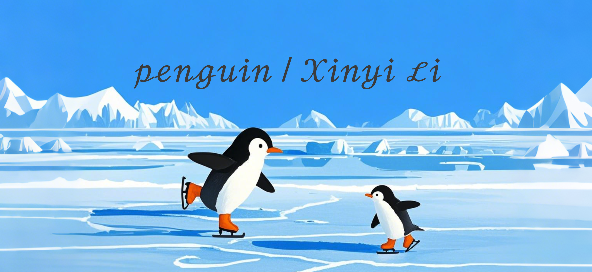

## HELLO WORLD 🐧
It's @Qiaowuyan speaking, a master student at ETH Zurich, majoring at Ecology and Evolution. Hope to make great contribution to our planet.

## INTERESTS
Conservation Genetics
Gene Reuse
Landscape Process
Species Distribution Modeling
Evolution and Social Behaviour
Environment, Socity, Goverment
Carbon Neutral

## LANGUAGES & SKILLS

## PENGUIN ICE LAND

  
  <!--  -->

  

<!---
27rabbitlt/27rabbitlt is a ✨ special ✨ repository because its `README.md` (this file) appears on your GitHub profile.
You can click the Preview link to take a look at your changes.
--->
